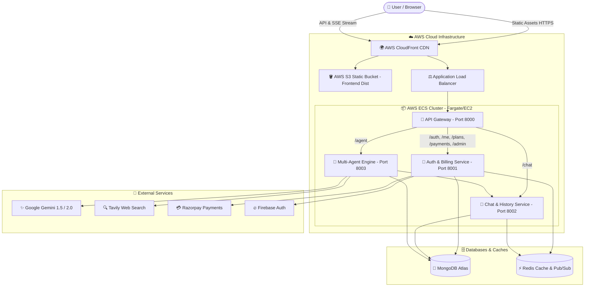
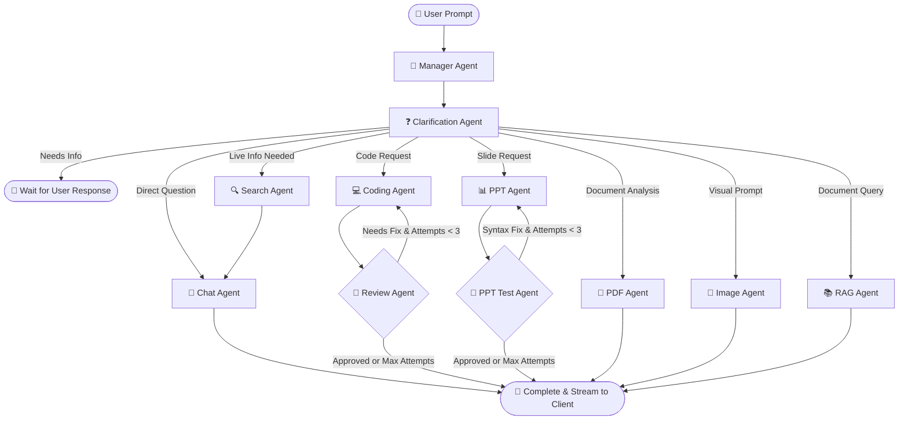
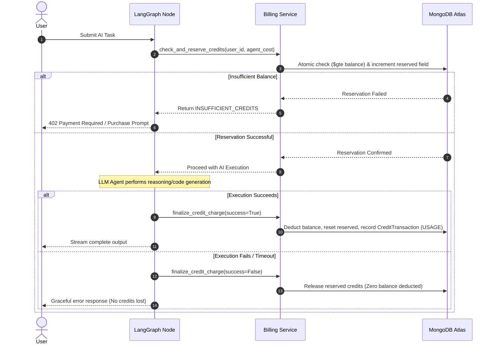

# 🌐 OmniMind AI — Enterprise Autonomous Multi-Agent AI Workspace & Monetization Platform

> 🚀 **Live Production URL:** [https://d2umt1bk4xz9sl.cloudfront.net](https://d2umt1bk4xz9sl.cloudfront.net)

OmniMind AI is a production-ready, distributed, multi-agent AI ecosystem featuring orchestrated LLM reasoning via **LangGraph**, real-time code sandboxing, automated PowerPoint presentation generation, live web intelligence, dynamic credit-ledger monetization, Razorpay payments, and an enterprise **AWS Cloud Deployment** architecture (ECS + ECR + S3 + CloudFront).

---

## 📑 Table of Contents
- [🌟 Key Architectural Highlights](#-key-architectural-highlights)
- [🏗️ System Architecture & Workflow](#️-system-architecture--workflow)
- [🤖 Multi-Agent AI System (LangGraph)](#-multi-agent-ai-system-langgraph)
  - [Agent Directory & Responsibilities](#agent-directory--responsibilities)
  - [Self-Correction & Review Loops](#self-correction--review-loops)
- [💳 Monetization, AI Credits & Payment System](#-monetization-ai-credits--payment-system)
  - [Agent Credit Cost Table](#agent-credit-cost-table)
  - [Credit Reservation & Deduction Strategy](#credit-reservation--deduction-strategy)
  - [Razorpay Payment Lifecycle](#razorpay-payment-lifecycle)
- [🗄️ Database Schemas (MongoDB)](#️-database-schemas-mongodb)
- [⚙️ Tech Stack by Microservice](#️-tech-stack-by-microservice)
- [🚀 DevOps & AWS Cloud Deployment Architecture](#-devops--aws-cloud-deployment-architecture)
  - [CI/CD Workflow Overview](#cicd-workflow-overview)
  - [AWS Services Employed](#aws-services-employed)
  - [Docker Containerization Strategy](#docker-containerization-strategy)
- [🔐 Environment Variables & Configuration](#-environment-variables--configuration)
  - [GitHub Actions Repository Secrets](#github-actions-repository-secrets)
  - [Service Environment Files](#service-environment-files)
- [💻 Local Development & Setup Guide](#-local-development--setup-guide)
- [⚡ API Route Reference](#-api-route-reference)

---

## 🌟 Key Architectural Highlights

1. **Autonomous LangGraph Orchestration**: Stateful multi-agent graph with dynamic routing, human-in-the-loop clarification, and iterative self-healing review loops.
2. **Interactive Code Sandbox & Live Preview**: Real-time rendering of generated HTML/CSS/JavaScript with responsive desktop/mobile viewport toggles and console log inspection.
3. **Automated PPT Generation**: End-to-end slide deck creation using `python-pptx` with automated visual layout validation.
4. **Real-Time Web Intelligence**: Autonomous Tavily search integration with source synthesis and citation formatting.
5. **Fault-Tolerant Credit Ledger**: Atomic credit reservation and post-execution deduction. Zero permanent credit deduction on failed agent runs, network timeouts, or errors.
6. **Razorpay & Plan Management**: Server-side HMAC SHA256 signature verification, webhook processing, and admin plan creation/management.
7. **Production Cloud Architecture**: Automated GitHub Actions CI/CD deploying containerized microservices to **Amazon ECS** via **Amazon ECR**, and hosting the frontend on **AWS S3** distributed globally through **AWS CloudFront**.

---

## 🏗️ System Architecture & Workflow



---

## 🤖 Multi-Agent AI System (LangGraph)

The core intelligence is powered by **LangGraph** in `backend/services/agent`. A stateful graph orchestrates user requests through specialized autonomous agents.



### Agent Directory & Responsibilities

| Agent Name | Description | Tools / Libraries Used | Credit Cost |
| :--- | :--- | :--- | :---: |
| **Manager Agent** | Analyzes user prompt intent, extracts entities, and selects the ideal execution pipeline. | Google Gemini, Structured JSON Output | **Free (0)** |
| **Clarification Agent** | Detects ambiguous or incomplete requirements (e.g. missing styling preference, incomplete requirements) before spending heavy compute. | LangChain, Conditional State Routing | **Free (0)** |
| **Chat Agent** | Handles general conversational reasoning, explanations, and synthesizes search results into cited responses. | Google Gemini 1.5/2.0 Flash/Pro | **2 Credits** |
| **Search Agent** | Conducts real-time web queries to retrieve up-to-date facts, documentation, news, and technical data. | Tavily Search API | **5 Credits** |
| **Coding Agent** | Generates full-stack modular code (HTML, CSS, JS, React, Python) with incremental in-place editing capabilities. | Gemini Code Models, AST parsing | **5 Credits** |
| **Review Agent** | Validates generated code against prompt specifications, detects bugs, syntax errors, or styling omissions, and instructs the Coding Agent to self-correct. | LangGraph Feedback Cycle, Code Evaluator | **2 Credits** |
| **PPT Agent** | Designs and builds structured presentation decks with custom layouts, typography, shapes, and color palettes. | `python-pptx`, Slide Master Engine | **10 Credits** |
| **PPT Test Agent** | Validates generated PPT files, ensuring text box boundaries, slide counts, shape properties, and styling integrity. | `pptx` Inspector, Self-Healing Loop | **2 Credits** |
| **RAG Agent** | Embeds, indexes, and queries private enterprise documents and vector stores. | Vector Store, Semantic Search | **5 Credits** |
| **PDF Agent** | Analyzes, summarizes, and extracts tabular and textual data from uploaded PDF documents. | `pypdf`, Document Parsers | **10 Credits** |
| **Image Agent** | Generates tailored image prompts and visual synthesis. | Imagen / Image Generation Models | **10 Credits** |

### Self-Correction & Review Loops
The `Coding Agent` and `PPT Agent` feature autonomous quality assurance loops:
* When code or slides are produced, the **Review Agent** checks for errors.
* If defects are detected, it routes back with specific remediation notes up to `MAX_REVIEW_ATTEMPTS` (Default: `3`).
* This guarantees production-quality output without manual developer intervention.

---

## 💳 Monetization, AI Credits & Payment System

OmniMind AI includes a comprehensive, audit-proof credit ledger and monetization platform:

### Agent Credit Cost Table
All costs are managed centrally in `backend/services/agent/utils/billing_service.py`:
```python
AGENT_CREDIT_COSTS = {
    "manager": 0,         # Free Orchestration
    "clarification": 0,   # Free Intent Clarification
    "chat": 2,            # 2 Credits
    "search": 5,          # 5 Credits
    "rag": 5,             # 5 Credits
    "coding": 5,          # 5 Credits
    "ppt": 10,            # 10 Credits
    "image": 10,          # 10 Credits
    "pdf": 10,            # 10 Credits
    "ppt_test": 2,        # 2 Credits
    "review": 2           # 2 Credits
}
```

### Credit Reservation & Deduction Strategy


### Razorpay Payment Lifecycle
1. **Plan Selection**: Client chooses an active plan from `GET /plans`.
2. **Server-Side Order Creation**: `POST /payments/create-order` creates a Razorpay order from MongoDB-stored prices (prices are never accepted from client inputs).
3. **Client Checkout**: Razorpay SDK modal handles payment collection.
4. **Signature Verification**: `POST /payments/verify` verifies HMAC SHA256 signature (`order_id + "|" + payment_id` against `RAZORPAY_KEY_SECRET`).
5. **Atomic Topup**: User's `CreditAccount.balance` is incremented and an immutable `CreditTransaction` (`PURCHASE`) record is logged.

---

## 🗄️ Database Schemas (MongoDB)

* **`User`**: Profile information, Firebase UID (`firebaseUID`), email, and authorization role (`"user"` | `"admin"`).
* **`CreditAccount`**: Holds `userId`, available `balance`, cumulative metrics (`totalGranted`, `totalPurchased`, `totalConsumed`), and active `reserved` credits.
* **`CreditTransaction`**: Audit ledger recording `amount`, `balanceBefore`, `balanceAfter`, `type` (`FREE_GRANT`, `PURCHASE`, `USAGE`, `REFUND`, `ADMIN_ADJUSTMENT`), and unique `referenceId`.
* **`Plan`**: Credit packages with `name`, `credits`, `price` (in paise, e.g. 10000 = ₹100), currency, and `isActive` flag.
* **`Purchase`**: Payment records containing `userId`, `planId`, `amount`, `status` (`PENDING`, `SUCCESS`, `FAILED`), `razorpayOrderId`, and payment signatures.
* **`Conversation` & `Message`**: Hierarchical chat threads with role histories (`user`, `assistant`), agent metadata, and token usage records.
* **`AIUsage`**: Telemetry capturing `agent` executed, LLM model used, duration, permanent `creditCost`, and success/failure status.

---

## ⚙️ Tech Stack by Microservice

### 1. Frontend (`frontend/`)
* **Framework**: React 18, Vite, TypeScript
* **State Management**: Redux Toolkit (Auth, Conversation, Credit, Plan slices)
* **Styling & UI**: Tailwind CSS, Lucide React icons, Glassmorphic modern dark themes
* **Code & Media**: React Syntax Highlighter, Live HTML/CSS/JS sandbox iframe, PPT download card
* **Streaming**: Server-Sent Events (SSE) consumer with real-time agent trace visualization

### 2. API Gateway (`backend/gateway/`)
* **Runtime**: Node.js 20, Express, TypeScript
* **Routing & Proxy**: `express-http-proxy` forwarding requests with preserved headers
* **Security & Auth**: Cookie Parser, JWT verification, Firebase Token extraction, `isAdmin` role guard
* **Caching & Logging**: Redis client, Morgan request logger

### 3. Auth & Billing Service (`backend/services/auth/`)
* **Runtime**: Node.js 20, Express, TypeScript, Mongoose
* **Integrations**: Firebase Admin SDK (Auth verification), Razorpay SDK (Order & Webhook verification)
* **Features**: Credit ledger management, idempotent user migrations, Admin plan & user adjustment APIs

### 4. Chat History Service (`backend/services/chat/`)
* **Runtime**: Python 3.13, Flask, Gunicorn, PyMongo
* **Package Manager**: Astral UV
* **Caching**: Redis caching for fast conversation and message retrieval (`chat:conversations:{userId}`)

### 5. Multi-Agent Reasoning Engine (`backend/services/agent/`)
* **Runtime**: Python 3.13, Flask, Gunicorn (threaded workers for SSE streaming)
* **Orchestration**: LangGraph, LangChain Core
* **Models**: Google Gemini 1.5 Flash / Pro, Gemini 2.0
* **Tools**: Tavily Search API, `python-pptx`

---

## 🚀 DevOps & AWS Cloud Deployment Architecture

The OmniMind AI infrastructure is fully automated using **GitHub Actions CI/CD** (`.github/workflows/deploy.yml`):

```mermaid
flowchart LR
    GitPush([📌 Git Push to main]) --> CI[🤖 GitHub Actions Runner]
    
    subgraph Job1 [Job 1: deploy-backend]
        CI --> AuthAWS1[AWS Configure Credentials]
        AuthAWS1 --> LoginECR[Login to Amazon ECR]
        LoginECR --> BuildImages[Build Multi-Stage Docker Images]
        BuildImages --> PushECR[Push Images to ECR Repositories]
        PushECR --> UpdateECS[AWS ECS Service Force-New-Deployment]
    end
    
    subgraph Job2 [Job 2: deploy-frontend]
        UpdateECS -->|needs: deploy-backend| BuildFE[Build Vite React App with Production Env]
        BuildFE --> SyncS3[Sync dist/ to AWS S3 Bucket]
        SyncS3 --> InvalidateCF[Invalidate CloudFront Cache /*]
    end
```



### AWS Services Employed

1. **Amazon ECR (Elastic Container Registry)**:
   * Private registries hosting versioned Docker images:
     * `omnimind-gateway:latest`
     * `omnimind-auth:latest`
     * `omnimind-chat:latest`
     * `omnimind-agent:latest`

2. **Amazon ECS (Elastic Container Service - Fargate / EC2)**:
   * Orchestrates container tasks for all 4 microservices across isolated task definitions.
   * Rolling updates executed via `aws ecs update-service --force-new-deployment` with zero downtime.

3. **AWS S3 (Simple Storage Service)**:
   * Hosts compiled static web assets (`dist/`) with static website hosting and restricted origin access identity (OAI).

4. **AWS CloudFront (Content Delivery Network)**:
   * Global edge caching, low-latency distribution, and SSL termination.
   * Automatic cache invalidation (`aws cloudfront create-invalidation --paths "/*"`) triggered on each deployment.

### Docker Containerization Strategy
* **Node.js Services (`gateway`, `auth`)**: Multi-stage `node:20-alpine` builds (Builder stage compiles TypeScript; Runner stage packages production `node_modules` and compiled `dist/`).
* **Python Services (`chat`, `agent`)**: Lightweight `python:3.13-slim` images using **Astral UV** (`--from=ghcr.io/astral-sh/uv:latest`) for blazing fast dependency resolution and Gunicorn production WSGI servers.

---

## 🔐 Environment Variables & Configuration

### GitHub Actions Repository Secrets
Configure these secrets in your GitHub Repository under **Settings ➔ Secrets and variables ➔ Actions**:

| Secret Name | Description |
| :--- | :--- |
| `AWS_ACCESS_KEY_ID` | AWS IAM Access Key ID with ECS, ECR, S3, and CloudFront permissions |
| `AWS_SECRET_ACCESS_KEY` | AWS IAM Secret Access Key |
| `AWS_REGION` | Target AWS Region (e.g. `us-east-1` or `ap-south-1`) |
| `AWS_ACCOUNT_ID` | 12-Digit AWS Account ID (for ECR repository URLs) |
| `ECS_CLUSTER_NAME` | Name of your AWS ECS Cluster |
| `ECS_GATEWAY_SERVICE_NAME` | ECS Service Name for API Gateway |
| `ECS_AUTH_SERVICE_NAME` | ECS Service Name for Auth Service |
| `ECS_CHAT_SERVICE_NAME` | ECS Service Name for Chat Service |
| `ECS_AGENT_SERVICE_NAME` | ECS Service Name for Agent Service |
| `S3_BUCKET_NAME` | S3 Bucket name hosting the frontend build |
| `CLOUDEFRONT_DISTRIBUTION_ID`| CloudFront Distribution ID for cache invalidation |
| `VITE_SERVER_URL` | Production Backend Gateway URL (e.g. `https://api.yourdomain.com` or CloudFront URL) |
| `VITE_FIREBASE_API_KEY` | Client-side Firebase Web API Key |

---

### Service Environment Files

#### 1. API Gateway (`backend/gateway/.env`)
```env
PORT=8000
NODE_ENV=production
FRONTEND_URL=http://localhost:5173
AUTH_SERVICE=http://localhost:8001
CHAT_SERVICE=http://localhost:8002
AGENT_SERVICE=http://localhost:8003
REDIS_URL=redis://localhost:6379
```

#### 2. Auth Service (`backend/services/auth/.env`)
```env
PORT=8001
NODE_ENV=production
MONGO_URL=mongodb+srv://<username>:<password>@cluster.mongodb.net/OmniMindAI
REDIS_URL=redis://localhost:6379
FRONTEND_URL=http://localhost:5173
RAZORPAY_KEY_ID=rzp_test_your_key_id
RAZORPAY_KEY_SECRET=your_razorpay_secret
RAZORPAY_WEBHOOK_SECRET=your_webhook_secret
```

#### 3. Chat Service (`backend/services/chat/.env`)
```env
PORT=8002
MONGO_URL=mongodb+srv://<username>:<password>@cluster.mongodb.net/OmniMindAI
REDIS_URL=redis://localhost:6379
```

#### 4. Agent Service (`backend/services/agent/.env`)
```env
PORT=8003
MONGO_URL=mongodb+srv://<username>:<password>@cluster.mongodb.net/OmniMindAI
GEMINI_API_KEY=AIzaSy...your_gemini_api_key
TAVILY_API_KEY=tvly-...your_tavily_api_key
CHAT_SERVICE=http://localhost:8002
MAX_REVIEW_ATTEMPTS=3
```

#### 5. Frontend (`frontend/.env`)
```env
VITE_SERVER_URL=http://localhost:8000
VITE_FIREBASE_API_KEY=AIzaSy...your_firebase_key
```

---

## 💻 Local Development & Setup Guide

### Prerequisites
* **Node.js**: v20.x or higher
* **Python**: v3.13.x (with `uv` or `pip`)
* **Docker & Docker Compose**
* **MongoDB Atlas** or local MongoDB instance
* **Redis** (local or containerized)

### Method A: Quickstart with Docker Compose (Recommended)
From the root directory:
```bash
# 1. Start all backend microservices, gateway, and redis
cd backend
docker compose up -d --build

# 2. Start the Frontend development server
cd ../frontend
npm install
npm run dev
```

### Method B: Manual Service Startup

```bash
# Terminal 1: Redis
docker run -p 6379:6379 --name omnimind-redis redis:7-alpine

# Terminal 2: API Gateway
cd backend/gateway
npm install
npm run dev

# Terminal 3: Auth Service
cd backend/services/auth
npm install
npm run dev

# Terminal 4: Chat Service
cd backend/services/chat
uv sync
uv run python main.py

# Terminal 5: Agent Service
cd backend/services/agent
uv sync
uv run python main.py

# Terminal 6: Frontend
cd frontend
npm install
npm run dev
```

---

## ⚡ API Route Reference

### User & Credit Endpoints
* `GET /me` — Current authenticated user profile & role.
* `GET /me/credits` — Available credit balance, total granted, and total consumed.
* `GET /me/credits/transactions` — Auditable ledger history of credit transactions.
* `GET /me/usage` — AI agent execution history and model metrics.
* `GET /plans` — List active credit purchase plans.
* `POST /payments/create-order` — Create Razorpay order for plan checkout.
* `POST /payments/verify` — Server verification of Razorpay HMAC signature.

### Chat & Conversation Endpoints
* `GET /chat/conversation` — List user conversations (cached in Redis).
* `POST /chat/conversation` — Create a new conversation session.
* `GET /chat/message/:conversationId` — Retrieve message history.
* `POST /chat/message` — Append user/assistant message.
* `PATCH /chat/message/:messageId` — In-place code / PPT revision update.

### Agent Execution Endpoints
* `POST /agent/call-agent` — Synchronous agent workflow execution.
* `POST /agent/call-agent/stream` — Real-time Server-Sent Events (SSE) stream with live agent trace, token delta chunks, and review notifications.

### Admin Endpoints (Requires `role: "admin"`)
* `GET /admin/plans` — View all plans (including inactive).
* `POST /admin/plans` — Create new pricing plan.
* `PATCH /admin/plans/:id` — Edit plan details, price, or credits.
* `DELETE /admin/plans/:id` — Soft-delete / deactivate plan.
* `GET /admin/users` — List platform users, roles, and credit balances.
* `POST /admin/users/:id/credits/adjust` — Grant or deduct user credits with audit reason.
* `GET /admin/purchases` — View complete transaction history across all users.
* `GET /admin/usage` — System-wide AI token and model consumption metrics.

---

## 📄 License & Attribution
Distributed under the MIT License. Built with ❤️ for enterprise AI multi-agent orchestration.
